# Clases

## Representación de rutas y ficheros

**`java.io.File`** Representa de forma abstracta rutas de ficheros y directorios. No es el contenido del fichero, sino una referencia de ruta (`fid`): puede preguntar si existe, si es directorio, crear, borrar o convertir a `Path`. Es una representación abstracta de nombres de ruta de ficheros y directorios. (<https://docs.oracle.com/en/java/javase/21/docs/api/java.base/java/io/File.html>)

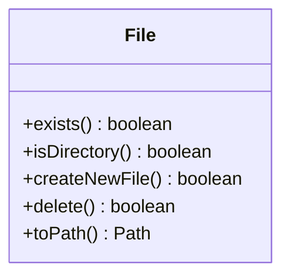

**`java.nio.file.Path`** Representa una ruta del sistema de ficheros en la API NIO. Es más **moderna** que `File` para trabajar con rutas, composición de rutas, rutas absolutas, relativas, nombres, padres y operaciones con `Files`. La documentación indica que `Path` localiza un fichero en un sistema de ficheros y puede interoperar con `File` mediante `toPath()` y `toFile()`. (<https://docs.oracle.com/en/java/javase/21/docs/api/java.base/java/nio/file/Path.html>)

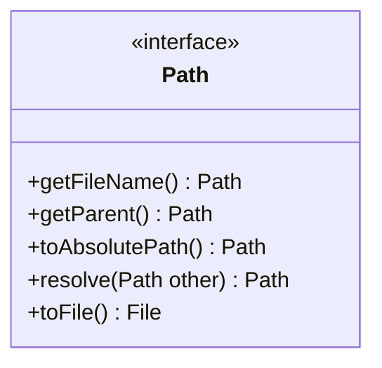

**`java.nio.files.Files`** Contiene únicamente métodos estáticos para el manejo de ficheros. (<https://docs.oracle.com/en/java/javase/21/docs/api/java.base/java/nio/file/Files.html>)

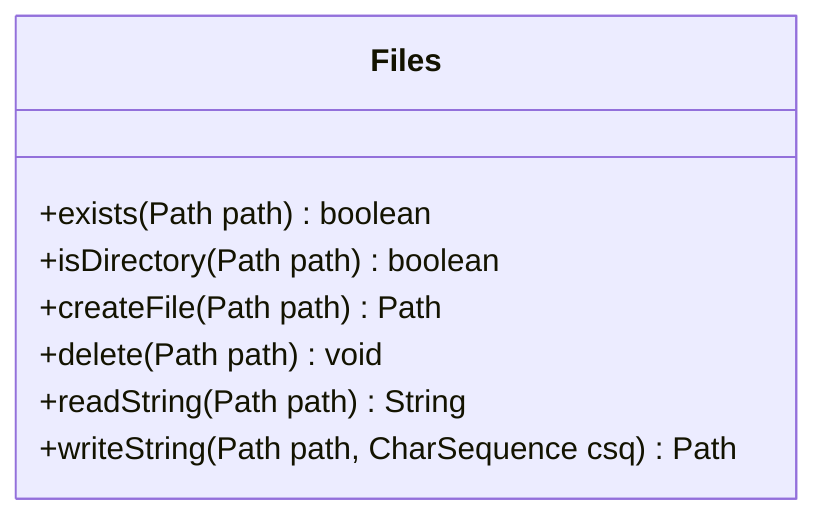

**`java.nio.file.FileSystem`** Información sobre el filesystem actual, la ruta actual (donde se ejecuta el programa), y generación de los `Path` respectivos. (<https://docs.oracle.com/en/java/javase/21/docs/api/java.base/java/nio/file/FileSystem.html>)

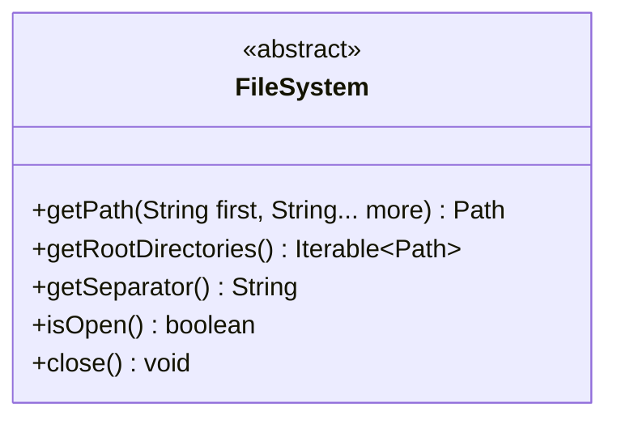

## Excepciones de entrada/salida

**`java.io.IOException`** Es la excepción base para errores de entrada/salida: fallos al leer, escribir, cerrar streams, acceder a ficheros, etc. Justifica su existencia porque agrupa errores de I/O recuperables o declarables mediante `throws`. (<https://docs.oracle.com/en/java/javase/21/docs/api/java.base/java/io/IOException.html>)

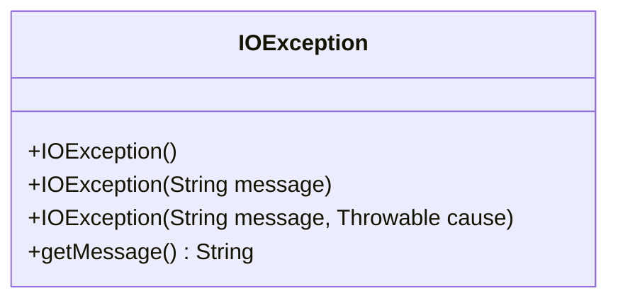

**`java.io.FileNotFoundException`** Especialización de `IOException` para indicar que un fichero no se puede abrir: no existe, es un directorio cuando se esperaba fichero, no hay permisos, o no puede crearse/abrirse. Aparece típicamente en constructores de `FileInputStream`, `FileOutputStream`, `FileReader`, `PrintWriter`, etc.; por ejemplo, `FileOutputStream` puede lanzarla si el destino no puede abrirse o crearse. (<https://docs.oracle.com/javase/8/docs/api/java/io/FileOutputStream.html>)

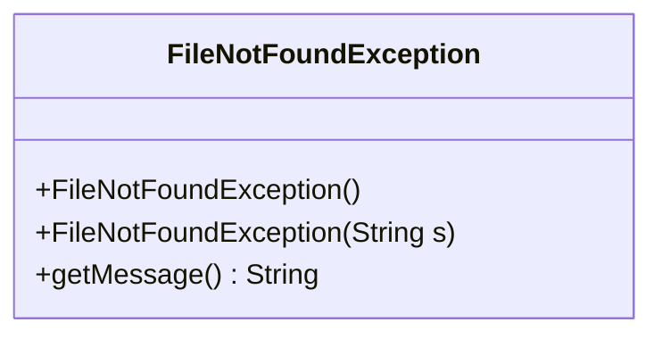

## Lectura de texto: caracteres

**`java.io.Reader`** Clase base **abstracta** para leer caracteres. Existe porque el tratamiento de texto implica codificación (juego de caracteres), formato (conforme a sistema operativo, `\n`, `\r\n`), y localización (conforme a región/idioma, relacionado con puntos de miles y decimales, moneda, y fechas principalmente). De ella derivan lectores como `InputStreamReader`, `FileReader` y `BufferedReader`. (<https://docs.oracle.com/javase/8/docs/api/java/io/Reader.html>)

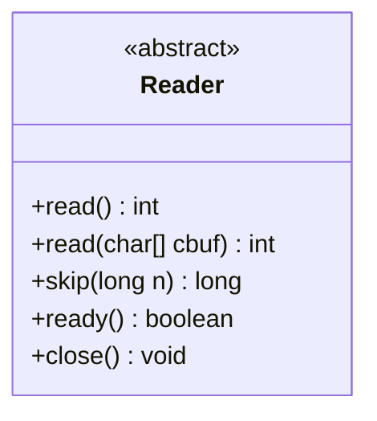

**`java.io.InputStream`** Clase base **abstracta** para leer bytes (**binario**) como **flujo** de datos desde cualquier origen: fichero, red, memoria, etc. Justifica su existencia porque unifica la lectura **binaria** mediante métodos comunes como `read()`, `read(byte[])` y `close()`. De ella derivan clases como `FileInputStream`, `FilterInputStream` y, directamente, `ObjectInputStream`. (<https://docs.oracle.com/en/java/javase/21/docs/api/java.base/java/io/InputStream.html>)

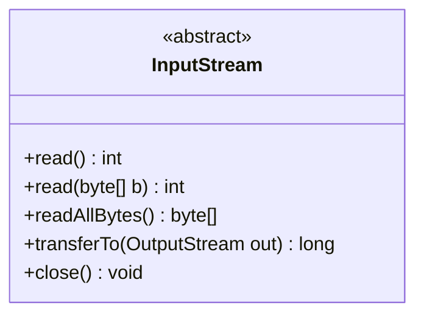

**`java.io.InputStreamReader`** Puente entre bytes y caracteres. Toma un `InputStream` y decodifica bytes usando un charset. Es esencial cuando el origen real es binario, pero el programa necesita texto. Es un puente de byte streams a character streams. (<https://docs.oracle.com/en/java/javase/21/docs/api/java.base/java/io/InputStreamReader.html>)

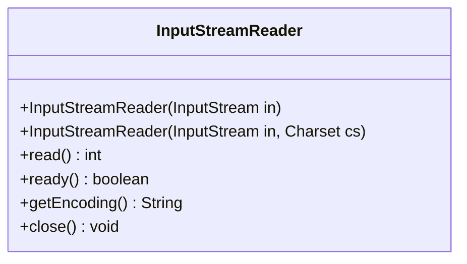

**`java.io.FileReader`** **Especialización** de `InputStreamReader` para leer caracteres directamente desde un fichero. Es cómoda para texto simple, aunque en código moderno suele preferirse controlar charset explícitamente con `InputStreamReader` o `Files.newBufferedReader`. Dependen de la **codificación de caracteres por defecto**. (<https://docs.oracle.com/en/java/javase/21/docs/api/java.base/java/io/FileReader.html>)

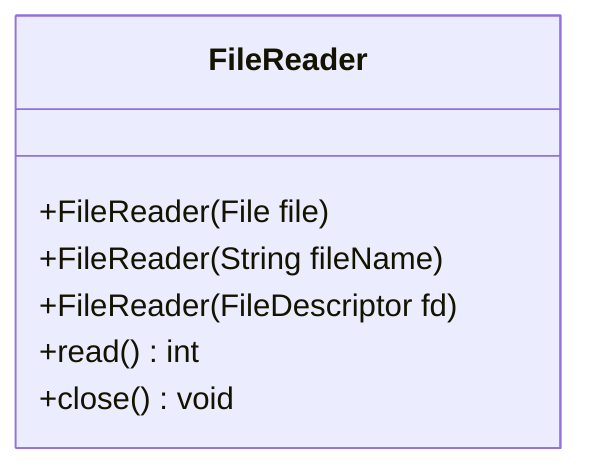

**`java.io.BufferedReader`** Envuelve un `Reader` y añade **buffer**. Sirve para reducir accesos costosos al origen y permite lectura por líneas con `readLine()`. Hace lectura secuencial, aunque puede avanzar a cierta posición del flujo. (<https://docs.oracle.com/javase/8/docs/api/java/io/BufferedReader.html>)

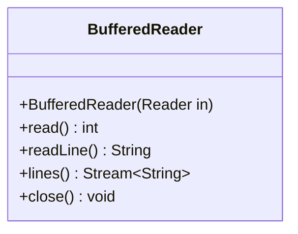

**`java.util.Scanner`** **Analizador de texto** por tokens. Sirve para leer texto y convertirlo a tipos primitivos o cadenas usando delimitadores y expresiones regulares. Puede leer desde `File`, `InputStream` o `Readable`, y puede usar `Locale` para interpretar formatos numéricos. Es un procesador de texto simple que parsea tipos primitivos y strings mediante expresiones regulares. (<https://docs.oracle.com/en/java/javase/21/docs/api/java.base/java/util/Scanner.html>)

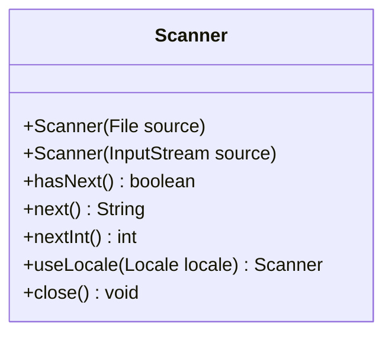

**`java.util.Locale`** Representa configuración regional: idioma, país y convenciones culturales. En gestión de ficheros aparece indirectamente con `Scanner`, por ejemplo para parsear números con coma decimal o punto decimal según región. (<https://docs.oracle.com/en/java/javase/21/docs/api/java.base/java/util/Locale.html>).

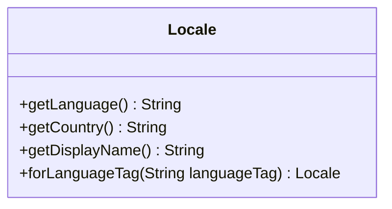

## Escritura de texto: caracteres

**`java.io.Writer`** Clase base **abstracta** para escribir caracteres. Existe para separar escritura textual de escritura binaria. Define operaciones como `write`, `flush` y `close`. (<https://docs.oracle.com/en/java/javase/21/docs/api/java.base/java/io/Writer.html>)

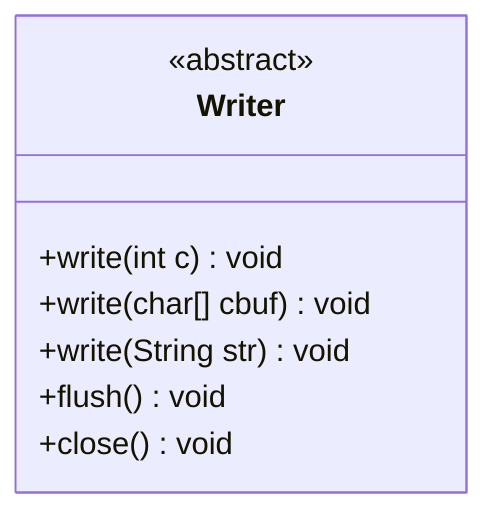

**`java.io.FileWriter`** Escribe caracteres en un fichero. Puede escribir en modo append. (<https://docs.oracle.com/en/java/javase/21/docs/api/java.base/java/io/FileWriter.html>)

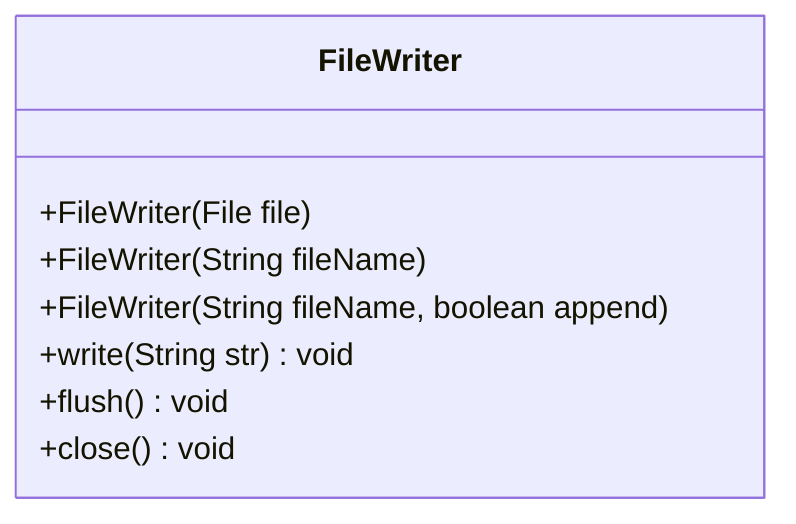

**`java.io.PrintWriter`** Escritor textual de alto nivel para `print`, `println`, `printf` y `format`. Existe para facilitar la salida formateada de texto hacia ficheros, writers u otros destinos. Es una clase que imprime representaciones formateadas de objetos a un stream de salida textual, y aclara que no escribe bytes crudos. (<https://docs.oracle.com/en/java/javase/21/docs/api/java.base/java/io/PrintWriter.html>)

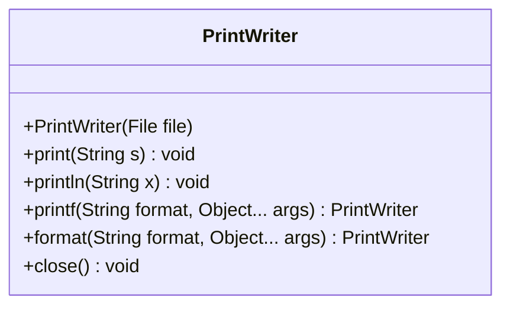

**`java.io.BufferedWriter`** Envuelve un `Writer` y añade buffer de salida. Sirve para reducir el número de escrituras físicas al sistema, acumulando caracteres en memoria antes de volcarlos. Proporciona métodos como `newLine()` y mejora el rendimiento frente a escrituras pequeñas repetidas. Es el equivalente natural de `BufferedReader` pero en escritura. (<https://docs.oracle.com/en/java/javase/21/docs/api/java.base/java/io/BufferedWriter.html>)

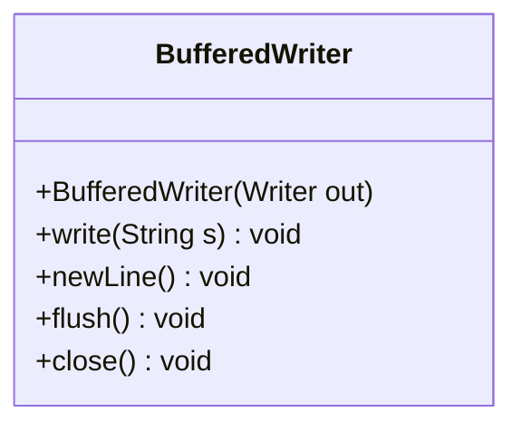

## Lectura binaria: bytes

**`java.io.InputStream`** Clase base **abstracta** para todos los **flujos** de entrada de bytes (binario). Existe para leer datos binarios independientemente de si vienen de fichero, red, memoria, etc. Sus métodos clave son `read`, `read(byte[])`, `readAllBytes`, `transferTo` y `close`. (<https://docs.oracle.com/en/java/javase/21/docs/api/java.base/java/io/InputStream.html>)


**`java.io.FileInputStream`** Lee bytes de forma **secuencial** desde un fichero. Es apropiado para datos binarios: imágenes, audio, documentos serializados, etc. También puede ser la base de otras clases como `InputStreamReader`, `BufferedInputStream`, `DataInputStream` u `ObjectInputStream`. (<https://docs.oracle.com/en/java/javase/21/docs/api/java.base/java/io/FileInputStream.html>)

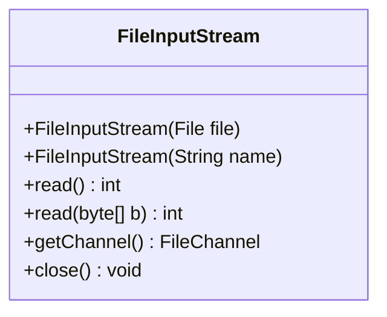

**`java.io.FilterInputStream`** Clase decoradora base para streams de entrada. Contiene otro `InputStream` protegido (`in`) y delega en él, permitiendo añadir funcionalidad sin cambiar el origen. Justifica la jerarquía de filtros como `BufferedInputStream` y `DataInputStream`. (<https://docs.oracle.com/en/java/javase/21/docs/api/java.base/java/io/FilterInputStream.html>)

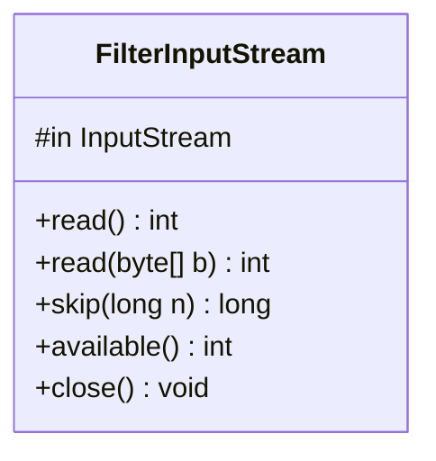

**`java.io.BufferedInputStream`** Añade buffer a un `InputStream`. Reduce llamadas al sistema o al dispositivo al leer bloques internamente. Es útil cuando se lee mucho dato binario en pequeñas operaciones. (<https://docs.oracle.com/en/java/javase/21/docs/api/java.base/java/io/BufferedInputStream.html>)

```mermaid
classDiagram
class BufferedInputStream {
  +BufferedInputStream(InputStream in)
  +read() int
  +read(byte[] b) int
  +mark(int readlimit) void
  +reset() void
  +close() void
}
```

**`java.io.DataInputStream`** Lee tipos primitivos Java (`int`, `double`, `boolean`, `UTF`, etc.) desde un `InputStream` de forma portable. Existe para interpretar bytes como datos tipados, no solo como bytes sueltos. (<https://docs.oracle.com/en/java/javase/21/docs/api/java.base/java/io/DataInputStream.html>)

```mermaid
classDiagram
class DataInputStream {
  +DataInputStream(InputStream in)
  +readBoolean() boolean
  +readInt() int
  +readDouble() double
  +readUTF() String
  +close() void
}
```

**`java.io.ObjectInputStream`** Deserializa objetos y datos primitivos previamente escritos por `ObjectOutputStream`. Existe para reconstruir grafos de objetos desde un stream binario, siempre que los objetos sean serializables. La documentación de `ObjectOutputStream` indica la relación inversa: los objetos escritos pueden leerse o reconstituirse con `ObjectInputStream`. (<https://docs.oracle.com/en/java/javase/21/docs/api/java.base/java/io/ObjectOutputStream.html>)

```mermaid
classDiagram
class ObjectInputStream {
  +ObjectInputStream(InputStream in)
  +readObject() Object
  +readInt() int
  +readUTF() String
  +close() void
}
```

## Escritura binaria: bytes

**`java.io.OutputStream`** Clase base **abstracta** para todos los flujos de salida de bytes. Existe para escribir datos binarios hacia un destino: fichero, red, memoria, etc. (<https://docs.oracle.com/en/java/javase/21/docs/api/java.base/java/io/OutputStream.html>)

```mermaid
classDiagram
class OutputStream {
  <<abstract>>
  +write(int b) void
  +write(byte[] b) void
  +flush() void
  +close() void
}
```

**`java.io.FileOutputStream`** Escribe bytes en un fichero. Es apropiado para datos binarios crudos, como imágenes o binarios. (<https://docs.oracle.com/javase/8/docs/api/java/io/FileOutputStream.html>)

```mermaid
classDiagram
class FileOutputStream {
  +FileOutputStream(File file)
  +FileOutputStream(String name)
  +FileOutputStream(String name, boolean append)
  +write(int b) void
  +getChannel() FileChannel
  +close() void
}
```

**`java.io.FilterOutputStream`** Clase decoradora base para streams de salida. Contiene otro `OutputStream` protegido (`out`) y delega en él. Sirve como base para añadir comportamiento: buffering, escritura de primitivos, etc. (<https://docs.oracle.com/en/java/javase/21/docs/api/java.base/java/io/FilterOutputStream.html>)

```mermaid
classDiagram
class FilterOutputStream {
  #out OutputStream
  +write(int b) void
  +write(byte[] b) void
  +flush() void
  +close() void
}
```

**`java.io.BufferedOutputStream`** Añade buffer a un `OutputStream`. Evita que cada `write` pequeño llegue directamente al sistema subyacente; acumula bytes y los vuelca con `flush()` o `close()`. (<https://docs.oracle.com/en/java/javase/21/docs/api/java.base/java/io/BufferedOutputStream.html>)

```mermaid
classDiagram
class BufferedOutputStream {
  +BufferedOutputStream(OutputStream out)
  +write(int b) void
  +write(byte[] b) void
  +flush() void
  +close() void
}
```

**`java.io.DataOutputStream`** Escribe tipos primitivos Java en formato binario portable sobre un `OutputStream`. Existe como pareja natural de `DataInputStream`. (<https://docs.oracle.com/en/java/javase/21/docs/api/java.base/java/io/DataOutputStream.html>)

```mermaid
classDiagram
class DataOutputStream {
  +DataOutputStream(OutputStream out)
  +writeBoolean(boolean v) void
  +writeInt(int v) void
  +writeDouble(double v) void
  +writeUTF(String str) void
  +flush() void
}
```

**`java.io.ObjectOutputStream`** Serializa objetos y tipos primitivos hacia un `OutputStream`. Existe para persistir o transmitir grafos de objetos Java. Escribe tipos primitivos y grafos de objetos, y que esos objetos pueden reconstituirse con `ObjectInputStream`; también exige que los objetos soporten `Serializable`. (<https://docs.oracle.com/en/java/javase/21/docs/api/java.base/java/io/ObjectOutputStream.html>)

```mermaid
classDiagram
class ObjectOutputStream {
  +ObjectOutputStream(OutputStream out)
  +writeObject(Object obj) void
  +writeInt(int val) void
  +writeUTF(String str) void
  +flush() void
  +close() void
}
```

# Tabla comparativa

| Paquete             | Clase                  | Lectura | Escritura | Buffer             | Secuencial | Aleatoria                   | Texto / binario      |
|---------------------|------------------------|---------|-----------|--------------------|------------|-----------------------------|----------------------|
| `java.io`           | `File`                 | ❌      | ❌        | ❌                 | ❌         | ❌                          | Ruta / metadatos     |
| `java.nio.file`     | `Path`                 | ❌      | ❌        | ❌                 | ❌         | ❌                          | Ruta / metadatos     |
| `java.util`         | `Scanner`              | ✔️       | ❌        | ✔️ interno          | ✔️          | ❌                          | Texto                |
| `java.io`           | `FileReader`           | ✔️       | ❌        | ❌                 | ✔️          | ❌                          | Texto                |
| `java.io`           | `BufferedReader`       | ✔️       | ❌        | ✔️                  | ✔️          | ❌                          | Texto                |
| `java.io`           | `InputStreamReader`    | ✔️       | ❌        | ❌                 | ✔️          | ❌                          | Texto                |
| `java.io`           | `FileInputStream`      | ✔️       | ❌        | ❌                 | ✔️          | ❌\*                        | Binario              |
| `java.io`           | `FilterInputStream`    | ✔️       | ❌        | ❌                 | ✔️          | ❌                          | Binario              |
| `java.io`           | `BufferedInputStream`  | ✔️       | ❌        | ✔️                  | ✔️          | ❌                          | Binario              |
| `java.io`           | `DataInputStream`      | ✔️       | ❌        | ❌                 | ✔️          | ❌                          | Binario tipado       |
| `java.io`           | `ObjectInputStream`    | ✔️       | ❌        | ❌                 | ✔️          | ❌                          | Binario / objetos    |
| `java.io`           | `FileWriter`           | ❌      | ✔️         | ❌                 | ✔️          | ❌                          | Texto                |
| `java.io`           | `PrintWriter`          | ❌      | ✔️         | ✔️ interno          | ✔️          | ❌                          | Texto                |
| `java.io`           | `FileOutputStream`     | ❌      | ✔️         | ❌                 | ✔️          | ❌\*                        | Binario              |
| `java.io`           | `FilterOutputStream`   | ❌      | ✔️         | ❌                 | ✔️          | ❌                          | Binario              |
| `java.io`           | `BufferedOutputStream` | ❌      | ✔️         | ✔️                  | ✔️          | ❌                          | Binario              |
| `java.io`           | `DataOutputStream`     | ❌      | ✔️         | ❌                 | ✔️          | ❌                          | Binario tipado       |
| `java.io`           | `ObjectOutputStream`   | ❌      | ✔️         | ❌                 | ✔️          | ❌                          | Binario / objetos    |
| `java.util`         | `Locale`               | ❌      | ❌        | ❌                 | ❌         | ❌                          | Formato regional     |
| `java.io`           | `RandomAccessFile`     | ✔️       | ✔️         | ❌                 | ✔️          | ✔️                           | Binario / primitivos |
| `java.nio.channels` | `FileChannel`          | ✔️       | ✔️         | ❌                 | ✔️          | ✔️                           | Binario              |
| `java.nio`          | `MappedByteBuffer`     | ✔️       | ✔️         | ✔️ memoria          | ❌         | ✔️                           | Binario              |
| `java.nio.file`     | `Files`                | ✔️       | ✔️         | depende del método | ✔️          | ✔️ con `SeekableByteChannel` | Texto / binario      |
| `java.nio.channels` | `SeekableByteChannel`  | ✔️       | ✔️         | ❌                 | ✔️          | ✔️                           | Binario              |
